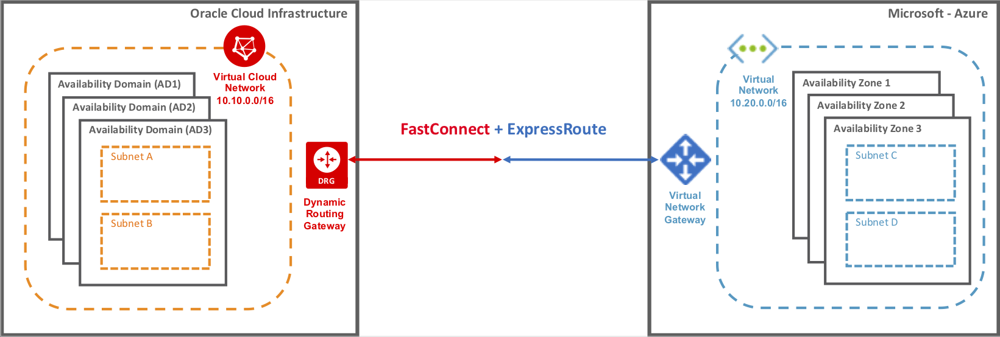

# azure2oci
本リポジトリは、`Microsoft Azure`(以下Azure)と`Oracle Cloud Inflastructure`(以下OCI)を使用したプライベートクラウド構築の検証を行うためのものです。インフラ構築には`Terraform`を使用します。

<br />

## 構築するインフラ一覧
|  Cloud  |  リソース名  |  概要  |
| ---- | ---- | ---- |
|  Azure  |  ExpressRoute  |  プライベート接続を作成  |
|    |   vNet  |  仮想ネットワーク  |
|    |   VirtualNetworkGateway  |  ExpressRoute用のゲートウェイ  |
|    |   VirtualMachine  |  動作確認用の仮想マシン  |
|  OCI  |  FastConnect  |  プライベート接続を作成  |
|    |   仮想クラウド・ネットワーク  |  仮想ネットワーク  |
|    |   動的ルーティングゲートウェイ  |  FastConnect用のゲートウェイ  |
|    |   インスタンス  |  動作確認用の仮想マシン  |

※ 代表的なものだけ列挙しています。

<br />



<br />

## 構築方法

1. Terraformをインストールします。

2. Azure CLIの設定をします。

3. OCI CLIの設定をします。

4. プロジェクトのルートディレクトリ下に`terraform.tfvars`という名前のファイルを作成します。

5. 3で設定したコンパートメントIDを4で作成したファイルに下記のように記載します。

    ```
    compartment_ocid = "ocid........"
    ```
6. プロジェクトのルートディレクトリ下に`ssh`という名前のディレクトリを作成し、秘密鍵、公開鍵をそれぞれ`id_rsa`、`id_rsa.pub`というファイル名で配置します。

7. 下記のコマンドを順に実行します。
    ```
    # 初期化処理
    $ terraform init

    # 実行計画作成(エラーを吐いた場合はメッセージに従って問題を解決してください)
    $ terraform plan

    # リソース作成(エラーを吐いた場合はメッセージに従って問題を解決してください)
    $ terraform apply --auto-approve
    ```
<br />

## 参考

[Azure と Oracle Cloud Infrastructure 間の直接相互接続をセットアップする](https://docs.microsoft.com/ja-jp/azure/virtual-machines/workloads/oracle/configure-azure-oci-networking)

<br />

## 仮想マシンで使用できるコマンド
- traceroute
- ifconfig

コマンドが実行できない場合は、仮想マシン構築時に実行される`cloud-init`が失敗している可能性があります。  
ログは`/var/log/cloud-init-output.log`で確認できます。  
